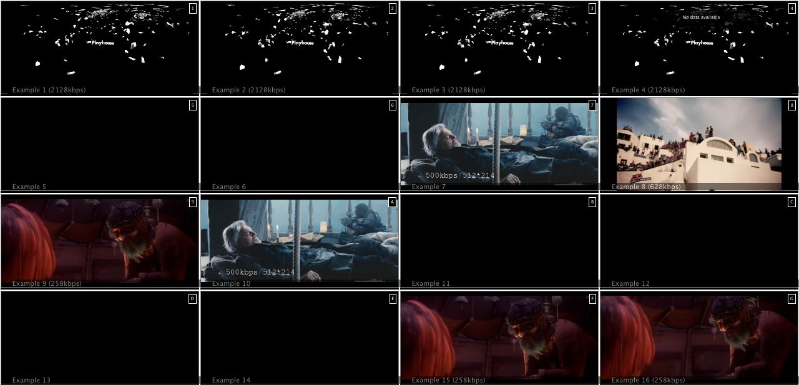

This is a web based multiview screen for HLS and MPEG-DASH streams based on hls.js and Shaka Player. Recommended to run in fullscreen mode.

Demo: http://labs.eyevinn.se/multiview/?config=example.json

Some limitations apply:

- No support for DRM protected content as this is often solutions specific to each site
- Only tested in Chrome and Safari

# Installation

Get the code from Github or fork the repository if you plan to contribute to this project.

		git clone https://github.com/malaniarpit/ott-multiview
		
Install the necessary node modules

		npm install
		
Start the Node express app

		npm start
# Claudiajs Support

## Running the example

1. run `npm install` to grab the dependencies
2. run `npm run generate-proxy` to create a simple proxy API for the express app
3. run `npm run deploy` to send everything up to AWS Lambda

The third step will print out a URL you can use to access the express app.

## Updating the app

1. Change [`app.js`](app.js)
2. (Optionally) use `npm install <PACKAGE NAME> -S` to install additional dependencies (always save them to `package.json` using `-S`)
3. Run `npm run update` to send the new version up to AWS. No need to generate the proxy again

## More information and limitations

See the [Running Express Apps in AWS Lambda](https://claudiajs.com/tutorials/serverless-express.html) tutorial.

		
# Usage

When the Node express app is up and running you can direct your Chrome browser to:

		http://localhost:3000/?config=example.json
                http://localhost:3000/?config=s3://some-bucket/example.json
		
where example.json is a configuration file placed in the directory config/ and can look like this:

		{
			"row0": [
				{ "title": "View port title",
				  "manifest": "http://example.com/master.m3u8",
				  "type": "hls" }
			],
			"row1": [
				{ "title": "View port title 2",
				  "manifest": "http://example.com/manifest.mpd",
				  "type": "dash" }
			]
		}

To toggle audio on or off click on the viewport that you want to listen to. A green border indicates for which viewport the audio is enabled. You can also use the keyboard keys 1-8.

## Keyboard Shortcuts
- SPACE - toggle play / pause for all viewports
- 1-9, A-G - activate audio for viewport 1 to 16
- f - toggle fullscreen mode
		
# Contribution

We are very happy if you want to contribute to this project. Just follow the "normal" procedures and:

1. Fork this repository
2. Create a topic branch in your fork
3. Add feature or fix bug in the topic branch
4. Issue a pull request explaining what has been done

